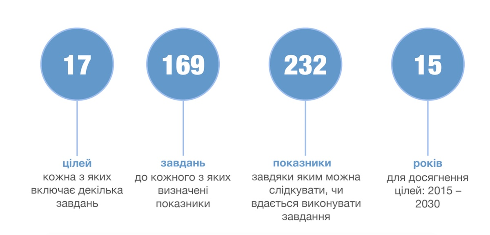
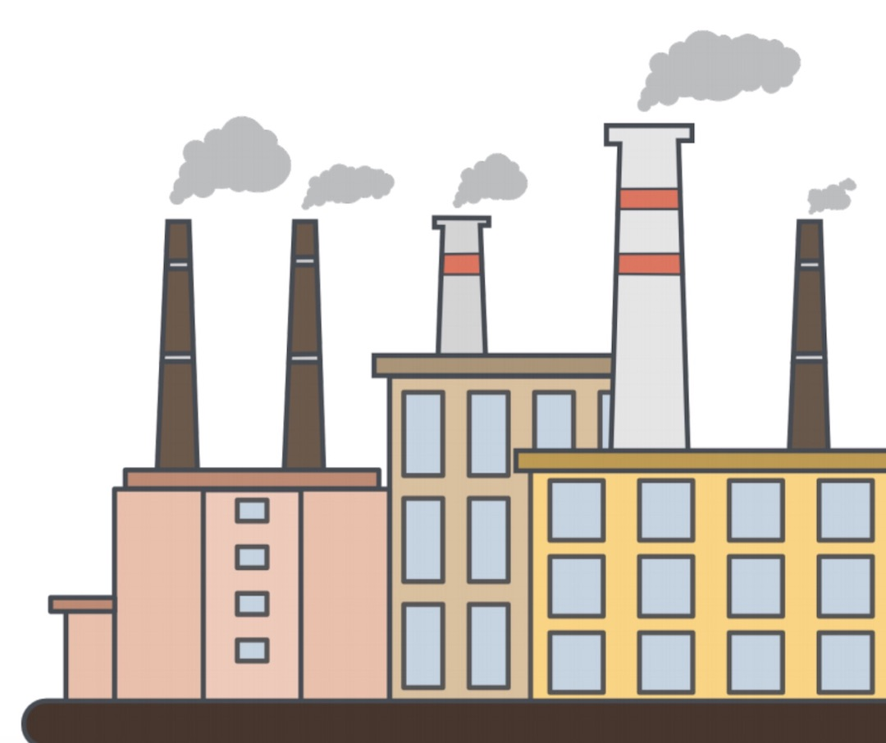

# Проблема насильства проти дітей

Про що цей урок?

Цей Урок створено, щоб діти дізналися більше про 17 Цілей Сталого Розвитку, затверджених ООН у 2015 році. Зокрема, задля подолання яких глобальних проблем розроблена кожна із Цілей та як вони взаємопов'язані. А також про те, як світові лідери, уряди держав, бізнес та громадянське суспільство спільно працюють над досягненням Цілей. І звісно про те, як дітям стати частиною змін. Мета уроку Мета уроку: ознайомити дітей із поняттям сталого розвитку, Глобальними цілями та пояснити, у чому їх важливість; пояснити як відбувається процес досягнення Цілей, навчити дітей знаходити рішення за допомогою Глобальних цілей.

  <iframe class="embed-responsive-item" src="https://www.youtube.com/embed/wHn1TBKHR3U?rel=0" allowfullscreen></iframe>

# Розуміння Глобальних цілей

Для досягнення позитивних змін, **кожна із 17-ти Цілей Сталого Розвитку передбачає відповідні завдання. Усього – 169 завдань.** А щоб слідкувати, чи вдається їх виконувати, досягати цілей та змінювати світ на краще, для кожного завдання визначили чіткі показники виконання. Їх ще називають індикаторами. **Усього – 232 показники.**

**Наприклад, Ціль 4 «Якісна освіта», серед інших передбачає таке завдання:**
> «Щоб до 2030 року всі молоді люди та значна кількість [дорослих] вміли писати, читати та рахувати». Тоді показником буде «Частка населення, яка досягла щонайменше встановленого рівня функціональної грамотності та математичної грамотності». 
Як це працює? Пояснюю: чим більше людей вміє читати, писати та рахувати, тим вищий цей показник. А отже, тим краще ми виконали відповідне завдання, і тим ближче до досягнення Цілі 4.

Загалом, уявіть 17 Цілей Сталого Розвитку як 17 рівнів у грі, у яку грає цілий світ. **Перемога означає подолання бідності, нерівності та збереження планети.** На кожному рівні потрібно виконати декілька завдань, які оцінюються за чіткими показниками. Та особливість гри в тому, що всі рівні дуже тісно пов’язані та однаково важливі, тому їх треба проходити водночас. І, що важливіше, ця гра дуже відрізняється від звичайних комп’ютерних ігор. **Якщо ми програємо, то пройти її заново вже не вдасться!**

Розглянемо це на прикладі будівництва та запуску нових заводів. Раніше Цілі Сталого Розвитку не враховувались, тому ніхто не зважав, з яких матеріалів будуються заводи, як це вплине на екологію, чи справедливо оплачується праця. Тоді вважали, що найголовніше завдання заводів — сприяти загальному економічному зростанню в регіоні й створенню робочих місць.

Безумовно, це важливо. Але такий вузький підхід уже застарів! Тепер ми маємо 17 нерозривно пов’язаних Цілей та три однаково важливих компоненти: економічний, соціальний та екологічний. То як мають будуватися заводи?

**Перш за все,** слід визначити, чи в цьому регіоні дійсно потрібен хоч один завод. Можливо, будівництво створить невиправдане навантаження на екологічну ситуацію, і варто скористатися альтернативним варіантом. Наприклад, відкрити нове виробництво на заводах, що вже існують, або розмістити новий завод в іншому регіоні. Рішення про будівництво має обговорюватися з місцевими жителями та прийматися з урахуванням їхньої думки.

**Друге.** Уже на етапі проектування заводу потрібно планувати:

* використання лише екологічно чистих матеріалів для будівництва;
* впровадження інноваційних технологій, які забезпечують максимальну енергоефективність та мінімальну шкідливість виробництва; 
* створення максимально безпечних умов праці та комфортного відпочинку робітників/-ниць.;

**Третє.** Кожному робітнику та робітниці має виплачуватись справедлива заробітна плата, надаватись медична страховка тощо.
