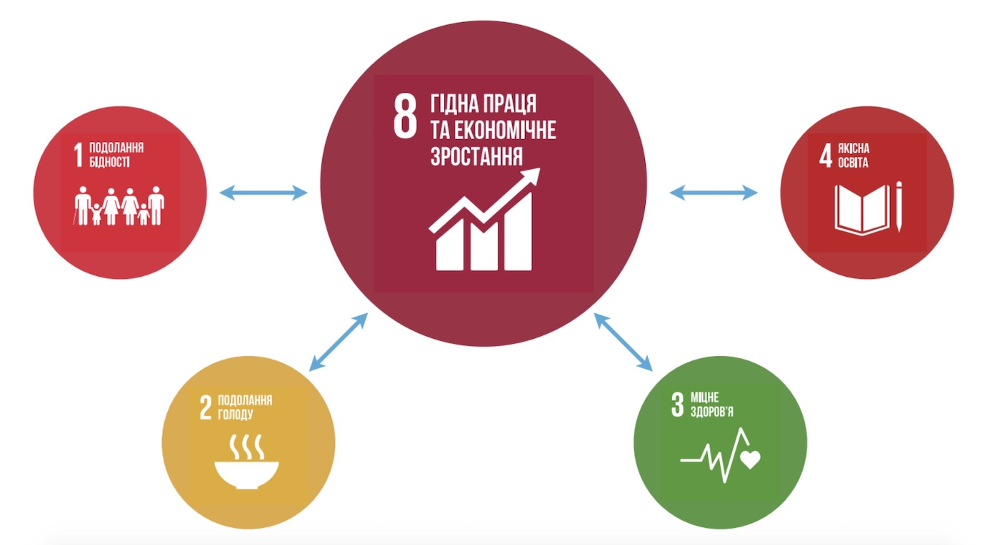

# Взаємозв’язок між Цілями Сталого Розвитку та їх реальність 

Будівництво та запуск заводів, **створення нових робочих місць – це, перш за все, внесок у досягнення Цілі 8.** Гідна праця та економічне зростання. Коли ж економічне зростання стабільне та справедливе, воно забезпечує належний рівень здоров'я та благополуччя людей. Адже в них є доступ до гідної праці, харчування (внесок у досягнення **Цілі 2.** Подолання голоду), житла (**Ціль 1.** Подолання бідності), медичного обслуговування (**Ціль 3.** Міцне здоров’я) та освіти (**Ціль 4.** Якісна освіта). Це, у свою чергу, сприяє підвищенню продуктивності та прибутковості (**Ціль 1**).

Зверніть увагу, економічне зростання впливає на здоров'я населення на різних етапах. Забезпечення гідної праці та базового доходу дозволяє швидко досягти успіхів у сфері здоров'я. Адже люди, які отримують вищі зарплати, одразу можуть дозволити собі більш якісні медичні послуги. Збільшення національного багатства зазвичай призводить до довготривалого покращення в сфері здоров'я. Адже тоді держава може збільшити витрати на покращення якості медицини.

Зв’язки між Цілями можна простежити й у зворотному напрямку. Так, здорове населення — це передумова економічного зростання. Водночас, занадто інтенсивне економічне зростання може призвести до погіршення екологічної ситуації. А отже, і погіршення, здоров’я населення. Хоча, у добре розвинених державах використовуються інноваційні технології (**Ціль 11**). Часто це дозволяє уникнути негативного впливу на екологію.

Про що цей урок?

Це запитання прямо стосується прогресу у досягненні <b>Цілі 16.</b> Мир та справедливість. Одне із завдань до Цілі – <b>завдання 16.1</b> – звучить так. «Значне скорочення поширення всіх форм насильства та зменшення показників смертності». Один з показників до цього завдання – <b>показник 16.1.2</b> – визначено як «частка людей, які відчувають себе в безпеці коли вони йдуть одні в своєму районі».

Як бачите, Цілі Сталого Розвитку – не щось далеке та абстрактне. Це глобальний план розвитку, який безпосередньо пов’язаний із реальним життям та існуючими проблемами.

