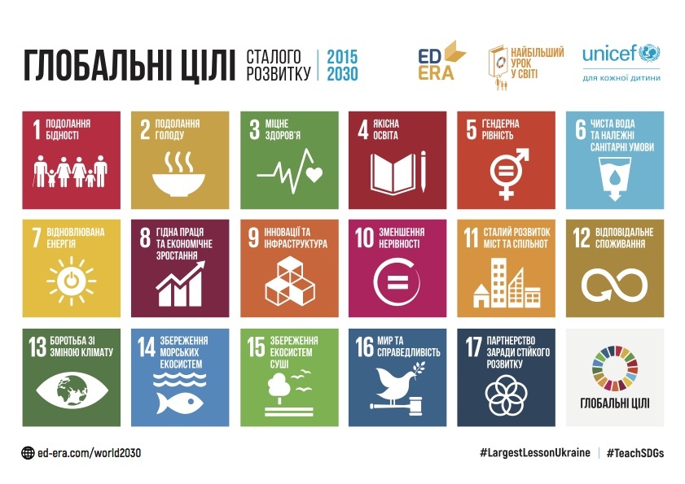

Тому, у вересні 2015 &nbsp;року, під час 70-ї сесії Генеральної Асамблеї ООН у Нью-Йорку, відбувся Саміт ООН з прийняття <strong><em>Порядку денного розвитку після 2015</em></strong> <strong><em>року</em></strong>, на якому було затверджено нові орієнтири розвитку. Ця подія стала кульмінацією довгого та інтенсивного процесу консультацій, який, з 2012 року, об&rsquo;єднав національні уряди, установи системи ООН та широке коло представників громадянського суспільства. <strong><em>Підсумковий документ &laquo;Перетворення нашого світу: порядок денний у сфері сталого розвитку до 2030 &nbsp;року&raquo; було затверджено 25 вересня 2015 року</em></strong> на відкритті Саміту ООН. <em>Документ містить преамбулу, декларацію, </em><strong><em>17 Цілей сталого розвитку та 169 завдань</em></strong>, засоби для реалізації та глобального партнерства, а також межі для подальшої діяльності та огляду ходу реалізації. ЦСР відображають масштаб та спрямування нового порядку денного, а також враховують незавершені питання Цілей розвитку тисячоліття. ЦСР є всеохоплюючими та неподільними, вони враховують три аспекти сталого розвитку: економічний, соціальний та екологічний.

Ось повні назви цілей:
<ul>
<li>Ціль 1. Подолати бідність у всіх її проявах та всюди</li>
<li>Ціль 2. Подолати голод, поліпшити харчування й розвивати сільське господарство</li>
<li>Ціль 3. Забезпечити здоровий спосіб життя та сприяти благополуччю всіх</li>
<li>Ціль 4. Забезпечити доступ до якісної освіти та до можливостей для навчання протягом життя</li>
<li>Ціль 5. Забезпечити рівні права та можливості для всіх жінок та дівчат</li>
<li>Ціль 6. Раціонально використовувати водні ресурси</li>
<li>Ціль 7. Використовувати недорогі, надійні, стійкі й сучасні джерела енергії</li>
<li>Ціль 8. Сприяти сталому економічному зростанню, повній зайнятості та гідній праці для всіх</li>
<li>Ціль 9. Створити стійку інфраструктуру, сприяти індустріалізації та інноваціям</li>
<li>Ціль 10. Скоротити нерівності всередині країн і між ними</li>
<li>Ціль 11: Зробити міста і населені пункти відкритими, безпечними, життєздатними та стійкими</li>
<li>Ціль 12: Забезпечити стійкі моделі споживання й виробництва</li>
<li>Ціль 13: Вжити термінових заходів з боротьби зі зміною клімату та його наслідками.</li>
<li>Ціль 14: Зберігати і раціонально використовувати океани, моря і морські ресурси</li>
<li>Ціль 15: Зберігати екосистеми суші, ліси, біорізноманіття, боротися з опустелюванням і деградацією земель</li>
<li>Ціль 16: Сприяти миру та забезпечувати доступ до правосуддя для всіх</li>
<li>Ціль 17: Посилювати глобальне партнерство в інтересах сталого розвитку</li>
</ul>

ЦСР встановлюють власні показники розвитку і включають <strong><em>17 цілей і 169 конкретних завдань.</em></strong> До кожного завдання розроблені <strong><em>індикатори</em></strong>, які дозволять моніторити прогрес у досягненні відповідного завдання та цілі. Наприклад:

<ul>
<li>Ціль 4. Якісна освіта</li>
<ul>
<li>Завдання: 4.6. Щоб до 2030 року всі молоді люди та значна кількість дорослого населення, як чоловіків, так і жінок, вміли писати, читати та рахувати. </li>
<li>Індикатор 4.6.1 Частка населення, яка досягла щонайменше встановленого рівня функціональної грамотності та математичної грамотності.</li>
</ul>
</ul>

17 Цілей, що спрямовані на досягнення трьох ключових результатів

<ol>
<li>Покінчити з крайньою бідністю;</li>
<li>Побороти нерівність у всьому світі;</li>
<li>Захистити планету (виявляти до неї повагу &nbsp;шляхом вирішення проблем, пов'язаних зі зміною клімату. Забезпечення того, щоб ніхто не був забутий).</li>
</ol>

